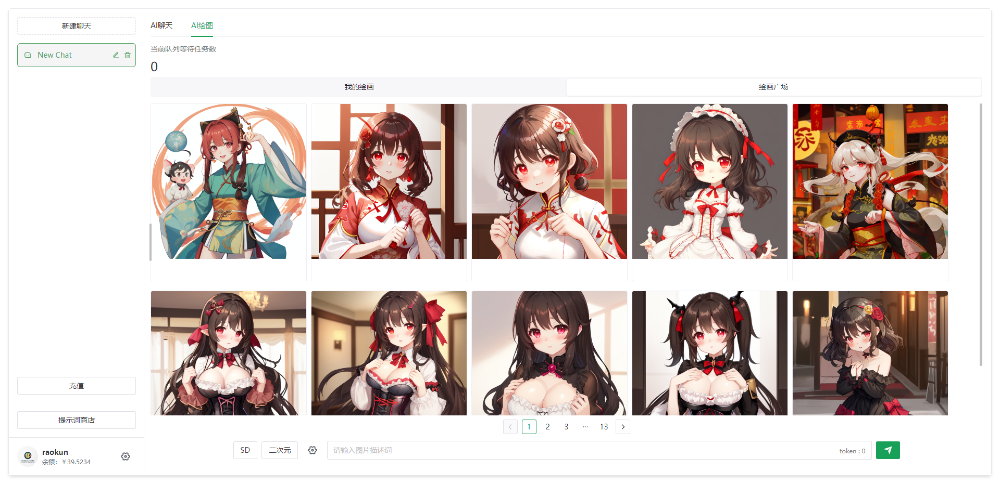
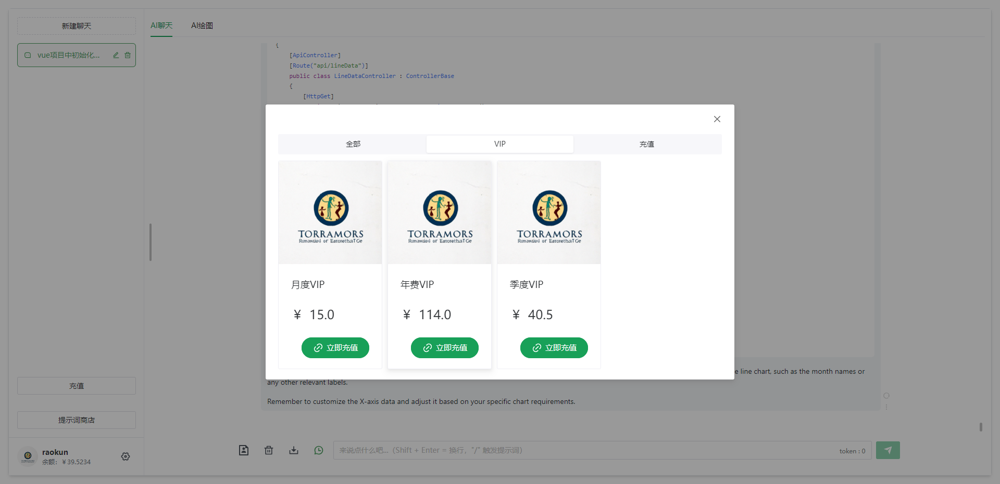
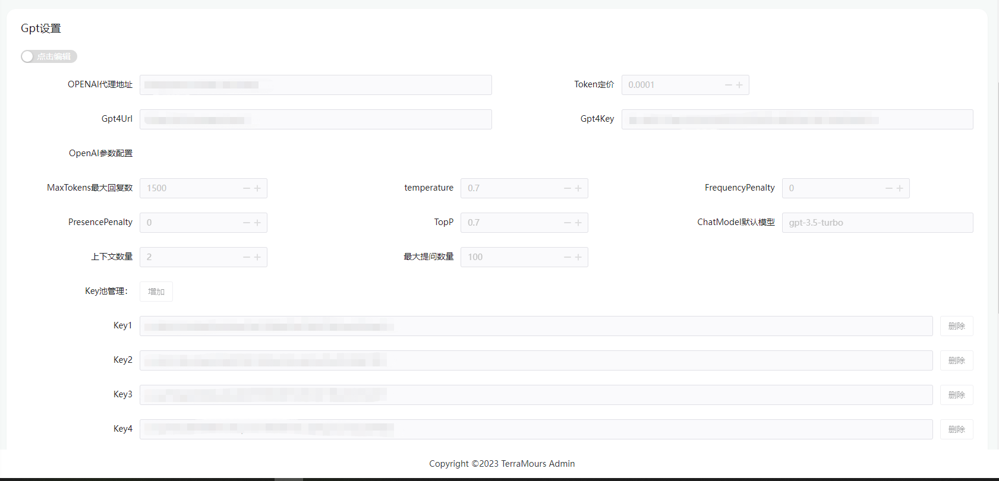

# TerraMours-Gpt-Web

简体中文 | [English](./README-En.md)

TerraMours实战项目，实现用户登陆和基于SK的多语言模型聊天、基于chatgpt和SD的多模型图片生成等功能。管理端实现数据看板、聊天记录管理，图片记录管理、用户管理、系统配置等。

TerraMours-Gpt-Web基于vue3.0+ts+naive UI+vite的ChatGPT项目前端。

官网地址：https://terramours.site/


## 已开发功能
- **AI聊天**：支持多种模型：gpt-3.5-turbo,gpt-3.5-turbo-16k,gpt-4,ChatGLM.支持Semantic Kernel整合。

- **AI绘图**：支持Stable Diffusion和chatgpt的dallE模型的图片生成

- **数据看板**：展示了多重数据统计，包含管理人员最关心的几种数据类型。图表展示多维度的聊天和画图数量的统计，分为三个维度：当天（按小时分段统计），按天统计和按月统计。以下是按天统计的数据内容

- **系统管理**：

	* **邮件服务配置**：配置系统邮件的api服务参数，用于邮件验证码发送。
	* **GPT设置**：配置GPT的代理地址，gpt的定价方案，接口参数，已经KEY池配置等。
	* **图片服务地址**：配置AI画图的服务地址

- **聊天记录**：聊天记录管理，查询使用者会话信息。（todo：1.导出功能2.创建微调模型）

- **敏感词管理**: 敏感词管理，自定义敏感词过滤，加强系统安全

- **Key池管理**：Key池管理，支持管理者添加多个key组成Key池，调用ai接口时轮询，加强稳定性

- **系统提示词**：系统提示词，添加各种角色提示词，让使用者能更好的使用ai对话。

- **绘图记录**：查看系统中图片的生成记录

- **菜单管理**：后台管理系统实现菜单的动态配置，通过菜单管理界面设置菜单，后端API在初始化时会加入基本的菜单。

- **角色管理**：后台管理系统的角色控制。默认创建超级管理员角色，普通用户角色。

- **用户管理**：管理系统中注册的用户

- **商品管理-商品分类**：设置商品的类型，归类等信息，方便商品管理

- **商品管理-商品列表**：设置商品信息

- **订单列表**：查看生成的订单


## 更新记录
2023.11.16 V1.1.1：
1.解决更新key池后的部分bug

2023.11.15 V1.1：
1.新增对 ChatGLM 的支持，前端模型选择添加 ChatGLM
2.重构key池接口。新key池可设置指定模型
3.修复 定价为0时，新增用户仍会提示余额不足的问题。

2023.10.31更新：
1.后端服务更新：
key池逻辑优化，优化key的分配。同时解决之前修改key池后需要重启服务的问题。

2023.10.30更新：
1.前端服务更新：修复前端注册和登录失败，失败信息未正常显示bug

2023.10.28更新：
1.实现聊天列表实时同步，手机电脑数据互通
2.修复登录失败一直显示加载中bug

2023.10.24更新：
针对dockercompose部署
1.修复支付失败bug
2.修复图片生成失败的bug
3.修复部分配置项修改未生效的问题

## 1.目录结构
```
├─ docker-compose（部署）
├─ kubernetes（部署）
├─ public(logo图片)
├─ service(接口)
├─ src(前端代码)
│  ├─ api（接口调用）
│  ├─ components（组件）
│  ├─ hooks（钩子）
│  ├─ plugins（插件）
│  ├─ router（路由）
│  ├─ store（主要记的本地缓存）
│  ├─ views（页面）
│  │  └─ chat
│  │  │  └─ components
│  │  │  └─layout(布局)
│  │  │  │  └─ Layout.vue(布局vue，基础)
│  │  │  │  └─ Permission.vue(免责声明和验证码弹窗，重要，登录框根据这个改)
│  │  │  └─index.vue(聊天页面)
│  └─ README.md
├─ .gitignore
└─ package.json
```

## 2.快速搭建

### 1.基于dockercompose的快速搭建AI聊天和画图系统

#### 1.新建一个空文件命名为docker-compose.yml

新建一个空文件命名为docker-compose.yml，将以下内容粘贴到文件中保存

```yaml
version: "3.9"
services:
  redis:
    image: redis
    container_name: redis_container
    ports:
      - "6379:6379"
    restart: always
    networks:
      - server

  postgres:
    image: postgres
    container_name: postgres_container
    environment:
      - POSTGRES_USER=postgres
      - POSTGRES_PASSWORD=terramours1024
      - POSTGRES_DB=TerraMoursGpt
    ports:
      - "5432:5432"
    restart: always
    networks:
      - server

  seq:
    image: datalust/seq
    container_name: seq_container
    environment:
      - ACCEPT_EULA=Y
    ports:
      - "5341:80"
    restart: always
    networks:
      - server

  server:
    image: raokun88/terramours_gpt_server:latest
    container_name: terramours_gpt_server
    environment:
      - TZ=Asia/Shanghai
      - ENV_DB_CONNECTION=Host=postgres;Port=5432;Userid=postgres;password=terramours1024;Database=TerraMoursGpt;
      - ENV_REDIS_HOST=redis:6379
      - ENV_SEQ_HOST=http://<YOUR-SERVER-IP>:5341/
    volumes:
      # 图片挂载地址，将容器中的图片挂载出来
      - /path/terra/images:/app/images
      # 可挂载自定义的配置文件快速进行系统配置
      #- F:\Docker\terra\server/appsettings.json:/app/appsettings.json
    ports:
      - "3116:80"
    restart: always
    networks:
      - server
    depends_on:
      - postgres
      - redis
  admin:
    image: raokun88/terramours_gpt_admin:latest
    container_name: terramoursgptadmin
    environment:
      - VUE_APP_API_BASE_URL=http://<YOUR-SERVER-IP>:3116
    ports:
      - "3226:8081"
    restart: always
    networks:
      - server

  web:
    image: raokun88/terramours_gpt_web:latest
    container_name: terramoursgptweb
    environment:
      - VUE_APP_API_BASE_URL=http://<YOUR-SERVER-IP>:3116
    ports:
      - "3216:8081"
    restart: always
    networks:
      - server

networks:
  server:
    driver:
      bridge

```

##### 安装注意

1.修改yml：将`<YOUR-SERVER-IP>` 替换成服务器IP<br/>
2.默认管理员账号密码：terramours@163.com  terramours@163.com<br/>
3.系统报错，通过seq查看，查看地址：`http://<YOUR-SERVER-IP>:5341/`<br/>
4.seq日志中显示`初始化数据库成功` 即代表后端服务初始化成功，首次安装可能会有报错的现象，建议dockercompose安装完成后重启terramours_gpt_server容器<br/>
5.更多服务配置，可以把服务端的github上的appsettings.json文件拷到服务端，通过挂载修改容器中的配置文件<br/>
```
# 可挂载自定义的配置文件快速进行系统配置
- /path/terra/appsettings.json:/app/appsettings.json
```


#### 2.上传dockercompose文件到服务器

上传dockercompose文件到服务器，我使用的是XFTP。

#### 3.执行docker命令，构建dockercompose

```shell
docker-compose up
```


### 2.使用docker命令构建前端项目

除了dockercompose以外，我们已经将前端镜像上传dockerhub，还可以采用docker命令快速构建前端项目。在服务器执行docker命令，命令如下

```shell
docker run --name terramoursgptweb -p 3216:8081 -e VUE_APP_API_BASE_URL=http://localhost:3002 --restart always -d raokun88/terramours_gpt_web:latest //VUE_APP_API_BASE_URL为后端API地址，请替换成对应的内容
```

**注意：VUE_APP_API_BASE_URL为后端API地址，请替换成对应的内容**


## 3.项目运行

#### 运行测试
```bash
pnpm dev
```
#### Docker 构建

```bash
docker build -t terramoursgptweb .

# 前台运行
docker run --name TerraMours_Gpt_Web -d -p 3002:4173 --restart always TerraMours_Gpt_Web

# 保存镜像
docker save -o chatweb.tar TerraMours_Gpt_Web

# 运行地址
http://localhost:3002/
```


## 4.项目截图

### 用户端






### 管理端





## [5.如何贡献](https://github.com/TerraMours/TerraMours_Gpt_Web#如何贡献)

1. Fork & Clone
2. Create Feature/name(your github id)/issuexxx branch
3. Commit with commit message, like `solve issue xxx，add xxx`
4. Create Pull Request

如果你希望参与贡献，欢迎 [Pull Requests](https://github.com/firstsaofan/TerraMours/pulls),或给我们 [Issues](https://github.com/firstsaofan/TerraMours/issues)


## [6.个人博客地址：](https://github.com/TerraMours/TerraMours_Gpt_Web#个人博客地址)

raokun:https://www.raokun.top/

firstsaofan:https://www.firstsaofan.top/


## [7.贡献者](https://github.com/TerraMours/TerraMours_Gpt_Web#贡献者)

[**raokun**](https://github.com/raokun)、[**Mortal**](https://github.com/mortal-nf)、[**firstsaofan**](https://github.com/firstsaofan)

